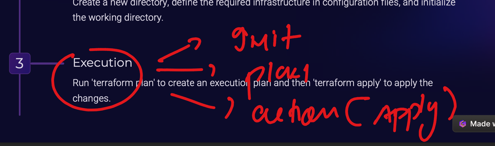
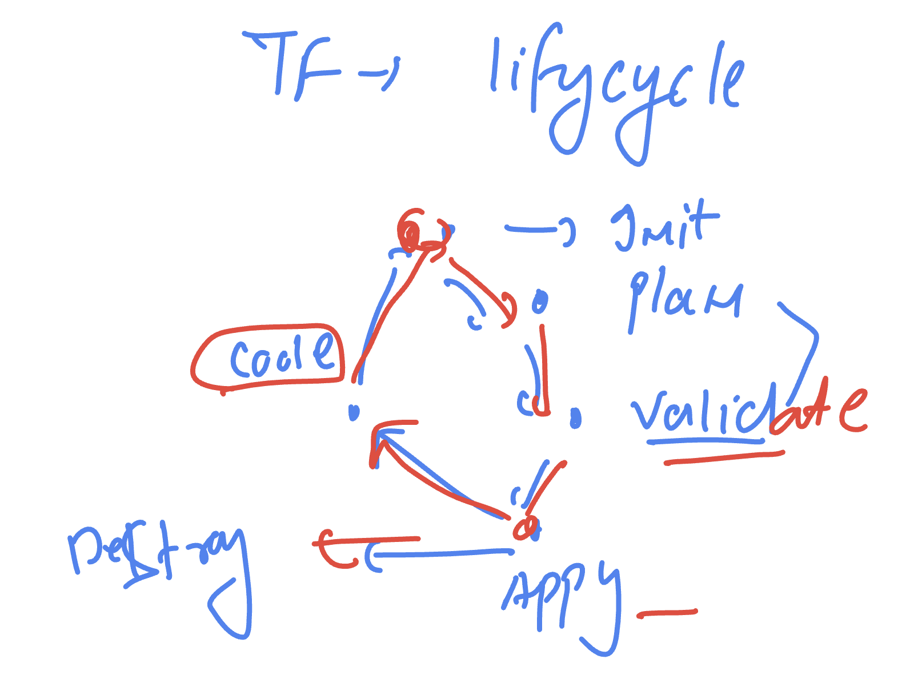
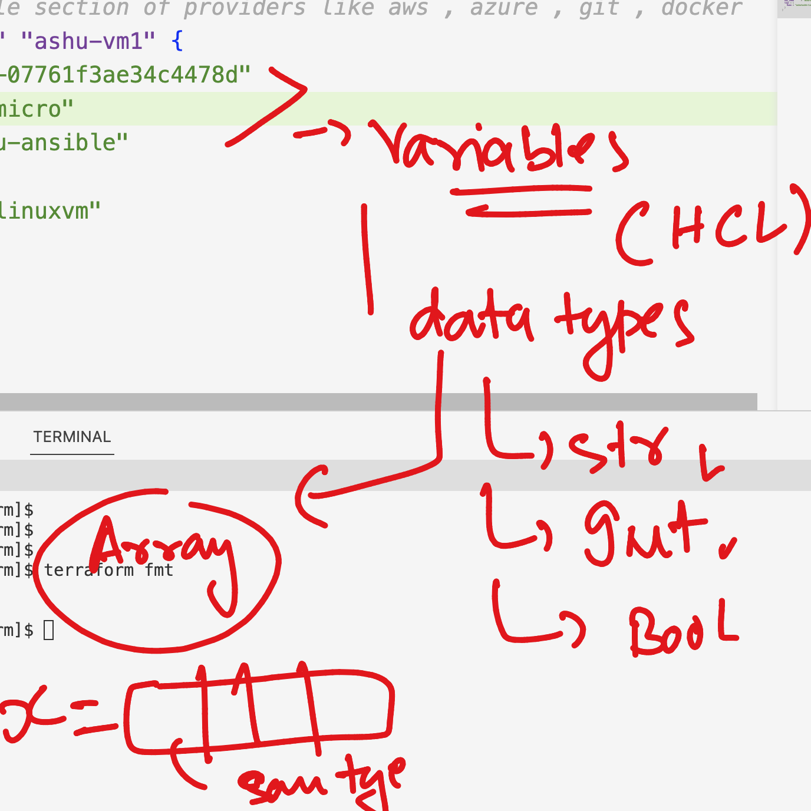
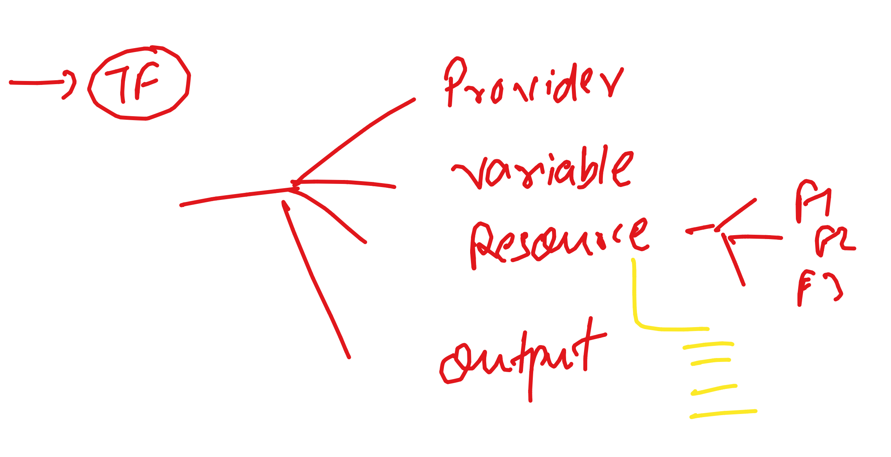

### Intro 

### install terraform on RHEL/centos/ Amazon linux 


### Terraform  things to go with 


### Execution process 




### Init In terraform 

```
[ashu@ip-172-31-18-146 poc]$ ls
ashu-ansible  ashu-gitlab  ashu-terraform
[ashu@ip-172-31-18-146 poc]$ cd ashu-terraform/
[ashu@ip-172-31-18-146 ashu-terraform]$ ls
provider.tf
[ashu@ip-172-31-18-146 ashu-terraform]$ ls -a
.  ..  provider.tf
[ashu@ip-172-31-18-146 ashu-terraform]$ terraform init 

Initializing the backend...

Initializing provider plugins...
- Finding latest version of hashicorp/aws...
- Installing hashicorp/aws v5.40.0...
- Installed hashicorp/aws v5.40.0 (signed by HashiCorp)

Terraform has created a lock file .terraform.lock.hcl to record the provider
selections it made above. Include this file in your version control repository
so that Terraform can guarantee to make the same selections by default when
you run "terraform init" in the future.

Terraform has been successfully initialized!

You may now begin working with Terraform. Try running "terraform plan" to see
any changes that are required for your infrastructure. All Terraform commands
should now work.

If you ever set or change modules or backend configuration for Terraform,
rerun this command to reinitialize your working directory. If you forget, other
commands will detect it and remind you to do so if necessary.
[ashu@ip-172-31-18-146 ashu-terraform]$ ls
provider.tf
[ashu@ip-172-31-18-146 ashu-terraform]$ ls -a
.  ..  provider.tf  .terraform  .terraform.lock.hcl
[ashu@ip-172-31-18-146 ashu-terraform]$ 
[ashu@ip-172-31-18-146 ashu-terraform]$ 
[ashu@ip-172-31-18-146 ashu-terraform]$ ls .terraform
providers
[ashu@ip-172-31-18-146 ashu-terraform]$ ls .terraform/providers/
registry.terraform.io
[ashu@ip-172-31-18-146 ashu-terraform]$ ls .terraform/providers/registry.terraform.io/
hashicorp
[ashu@ip-172-31-18-146 ashu-terraform]$ ls .terraform/providers/registry.terraform.io/hashicorp/
aws
[ashu@ip-172-31-18-146 ashu-terraform]$ ls .terraform/providers/registry.terraform.io/hashicorp/aws/
5.40.0
```


### plan 

```
[ashu@ip-172-31-18-146 ashu-terraform]$ terraform plan 

Terraform used the selected providers to generate the following execution plan. Resource actions are indicated with the
following symbols:
  + create

Terraform will perform the following actions:

  # aws_instance.ashu-vm1 will be created
  + resource "aws_instance" "ashu-vm1" {
      + ami                                  = "ami-07761f3ae34c4478d"
      + arn                                  = (known after apply)
      + associate_public_ip_address          = (known after apply)
```

### apply 

```
ashu@ip-172-31-18-146 ashu-terraform]$ terraform apply 

Terraform used the selected providers to generate the following execution plan. Resource actions are indicated with the
following symbols:
  + create

Terraform will perform the following actions:

  # aws_instance.ashu-vm1 will be created
  + resource "aws_instance" "ashu-vm1" {
      + ami                                  = "ami-07761f3ae34c4478d"
      + arn                                  = (known after apply)
      + associate_public_ip_address          = (known after apply)
      + availability_zone                    = (known after apply)
      + cpu_core_count                       = (known after apply)
      + cpu_threads_per_core                 = (known after apply)
      + disable_api_stop                     = (known after apply)
      + disable_api_termination              = (known after apply)
      + ebs_optimized                        = (known after apply)
      + get_password_data                    = false
      + host_id                              = (known after apply)
      + host_resource_group_arn              = (known after apply)
      + iam_instance_profile                 = (known after apply)
      + id                                   = (known after apply)
      + instance_initiated_shutdown_behavior = (known after apply)
      + instance_lifecycle                   = (known after apply)
      + instance_state                       = (known after apply)
      + instance_type                        = "t2.micro"
      + ipv6_address_count                   = (known after apply)
      + ipv6_addresses                       = (known after apply)
      + key_name                             = "ashu-ansible"
      + monitoring                           = (known after apply)
      + outpost_arn                          = (known after apply)
      + password_data                        = (known after apply)
      + placement_group                      = (known after apply)
      + placement_partition_number           = (known after apply)
      + primary_network_interface_id         = (known after apply)
      + private_dns                          = (known after apply)
      + private_ip                           = (known after apply)
      + public_dns                           = (known after apply)
      + public_ip                            = (known after apply)
      + secondary_private_ips                = (known after apply)
      + security_groups                      = (known after apply)
      + source_dest_check                    = true
      + spot_instance_request_id             = (known after apply)
      + subnet_id                            = (known after apply)
      + tags_all                             = (known after apply)
      + tenancy                              = (known after apply)
      + user_data                            = (known after apply)
      + user_data_base64                     = (known after apply)
      + user_data_replace_on_change          = false
      + vpc_security_group_ids               = (known after apply)
    }

Plan: 1 to add, 0 to change, 0 to destroy.
╷
│ Warning: Version constraints inside provider configuration blocks are deprecated
│ 
│   on provider.tf line 5, in provider "aws":
│    5:   version = "5.40.0"
│ 
│ Terraform 0.13 and earlier allowed provider version constraints inside the provider configuration block, but that is
│ now deprecated and will be removed in a future version of Terraform. To silence this warning, move the provider version
│ constraint into the required_providers block.
╵

Do you want to perform these actions?
  Terraform will perform the actions described above.
  Only 'yes' will be accepted to approve.

  Enter a value: yes

aws_instance.ashu-vm1: Creating...
aws_instance.ashu-vm1: Still creating... [10s elapsed]
```

### apply again 

```
[ashu@ip-172-31-18-146 ashu-terraform]$ terraform apply --auto-approve 
aws_instance.ashu-vm1: Refreshing state... [id=i-05359026992894e98]

Terraform used the selected providers to generate the following execution plan. Resource actions are indicated with the
following symbols:
  ~ update in-place

Terraform will perform the following actions:

  # aws_instance.ashu-vm1 will be updated in-place
  ~ resource "aws_instance" "ashu-vm1" {
        id                                   = "i-05359026992894e98"
      ~ tags                                 = {
          + "name" = "ashutoshh-linuxvm"
        }
      ~ tags_all                             = {
          + "name" = "ashutoshh-linuxvm"
        }
        # (31 unchanged attributes hidden)

        # (8 unchanged blocks hidden)
    }

Plan: 0 to add, 1 to change, 0 to destroy.
aws_instance.ashu-vm1: Modifying... [id=i-05359026992894e98]
aws_instance.ashu-vm1: Modifications complete after 1s [id=i-05359026992894e98]
╷
│ Warning: Version constraints inside provider configuration blocks are deprecated
│ 
│   on provider.tf line 5, in provider "aws":
│    5:   version = "5.40.0"
│ 
│ Terraform 0.13 and earlier allowed provider version constraints inside the provider configuration block, but that is
│ now deprecated and will be removed in a future version of Terraform. To silence this warning, move the provider version
│ constraint into the required_providers block.
╵

Apply complete! Resources: 0 added, 1 changed, 0 destroyed.
```

### TF lifecycle 



### Variables in TF 



### terraform work format 



## Terrform resoruces 

### create key pair method 1 

```
# using existing key in your tf machine
# resource "aws_key_pair" "ashu-key-new" {
#   key_name   = "ashunew-key"
#   public_key = file("/home/ashu/.ssh/id_rsa.pub")
# }

# Define Algo 
resource "tls_private_key" "ashu-algo" {
  algorithm = "RSA"
  rsa_bits  = 4096 # 2048 or 4096 
}
# creating key pair 
resource "aws_key_pair" "ashu-key-gen" {
  key_name   = "ashu-tf-key"
  public_key = tls_private_key.ashu-algo.public_key_openssh 
} 

# storing private key in terraform machine 
resource "local_file" "ssh_key" {
  filename = "${aws_key_pair.ashu-key-gen.key_name}.pem"
  content  = tls_private_key.ashu-algo.private_key_pem
}

```

### use key pair 

```
# we can define multiple section of providers like aws , azure , git , docker
resource "aws_instance" "ashu-vm1" {
  ami           = var.my-ami
  instance_type = "t2.micro"
  key_name      = aws_key_pair.ashu-key-gen.key_name
  tags = {
    Name = "ashutoshh-linuxvm"
  }
}


```

## Introduction to provisioner 


### Remove provisioner Code with ec2

```
# we can define multiple section of providers like aws , azure , git , docker
resource "aws_instance" "ashu-vm1" {
  ami           = var.my-ami
  instance_type = "t2.micro"
  key_name      = aws_key_pair.ashu-key-gen.key_name
  tags = {
    Name = "ashutoshh-linuxvm"
  }
  # define provisioner here 
    provisioner "remote-exec" {
      inline = [ 
        # write steps to install httpd server and host a static webpage 
        "sudo yum update -y" ,
        "sudo yum install httpd git -y" ,
       " cd /tmp",
       "git clone https://github.com/schoolofdevops/html-sample-app.git" ,
        "sudo cp -rf html-sample-app/*  /var/www/html/",
        "sudo systemctl enable --now httpd" 
       ]
    }
    # we can define connection details here 
    connection {
      type = "ssh"
      user = "ec2-user"
      host = self.public_ip
      timeout = "3m"
      private_key = file("/home/ashu/poc/ashu-terraform/ashu-tf-key.pem") 
    }


}


```


