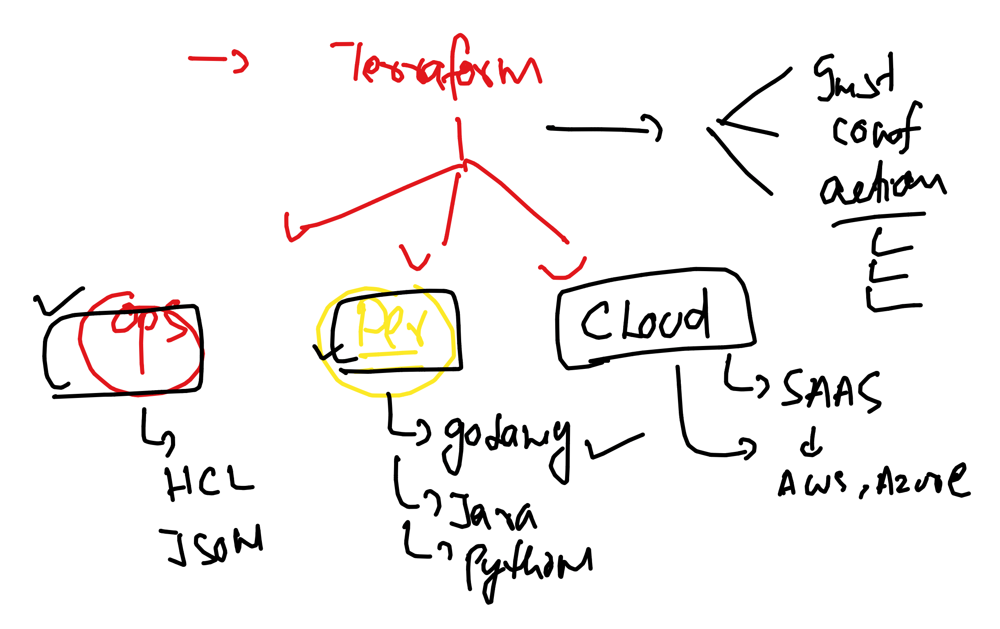

### Revision 



### using cloud init tempalte 

### cloud-init.yml

```
#cloud-config
packages:
  - httpd
  - git
runcmd:
  - sudo systemctl enable --now httpd
  - sudo echo "hello Roche , i am ashutoshh " >/var/www/html/index.html
```

### import as data source 

```
# refering cloud-init script 
data "template_file" "ashu-user_data" {
  template = file("./scripts/cloud-init.yml")
}

# calling existing VPC 
data "aws_vpc" "ashu-vpcnew" {
   # please define vpc id here of NV region 
   id = "vpc-0613e72a46c8cb335"
}
```

### using in ec2 launch 

```
resource "aws_instance" "rp-vm1" {
  ami           = var.ami
  instance_type = "t2.micro"
  key_name      = aws_key_pair.generated_key.key_name
  vpc_security_group_ids = [aws_security_group.ashu-allow_tls.id]

  tags = {
    Name = "rp-linuxvm"
  }
  user_data = data.template_file.ashu-user_data.rendered # calling cloud init

  # connection {
  #   type        = "ssh"
  #   user        = "ec2-user"
  #   private_key = file("./${aws_key_pair.generated_key.key_name}.pem")
  #   host        = self.public_ip
  # }

  # provisioner "file" {
  #   source      = "scripts/web.sh"
  #   destination = "/tmp/web.sh"
  # }

  # provisioner "remote-exec" {
  #   script = "./scripts/web.sh" # in local terraform machine location
  #   inline = [
	# # "chmod +x  /tmp/web.sh",
	# "bash /tmp/web.sh"
	# ]
  # }
}


```

### now we can apply 

```
ashu@ip-172-31-18-146 wc]$ terraform init --upgrade

Initializing the backend...

Initializing provider plugins...
- Finding latest version of hashicorp/tls...
- Finding latest version of hashicorp/template...
- Finding hashicorp/aws versions matching "5.40.0"...
- Finding latest version of hashicorp/local...
- Using previously-installed hashicorp/tls v4.0.5
- Installing hashicorp/template v2.2.0...
- Installed hashicorp/template v2.2.0 (signed by HashiCorp)
- Using previously-installed hashicorp/aws v5.40.0

=====>>

Use terraform plan and apply 
```

### multiple index with new names 


```
resource "aws_instance" "rp-vm1" {
  ami           = var.ami
  count = 2 
  instance_type = "t2.micro"
  key_name      = aws_key_pair.generated_key.key_name
  vpc_security_group_ids = [aws_security_group.ashu-allow_tls.id]

  tags = {
    Name = "rp-linuxvm-${count.index + 1}" # adding machine names
  }
  user_data = data.template_file.ashu-user_data.rendered # calling cloud init

  # connection {
  #   type        = "ssh"
  #   user        = "ec2-user"
  #   private_key = file("./${aws_key_pair.generated_key.key_name}.pem")
  #   host        = self.public_ip
  # }

  # provisioner "file" {
  #   source      = "scripts/web.sh"
  #   destination = "/tmp/web.sh"
  # }

  # provisioner "remote-exec" {
  #   script = "./scripts/web.sh" # in local terraform machine location
  #   inline = [
	# # "chmod +x  /tmp/web.sh",
	# "bash /tmp/web.sh"
	# ]
  # }
}


```
