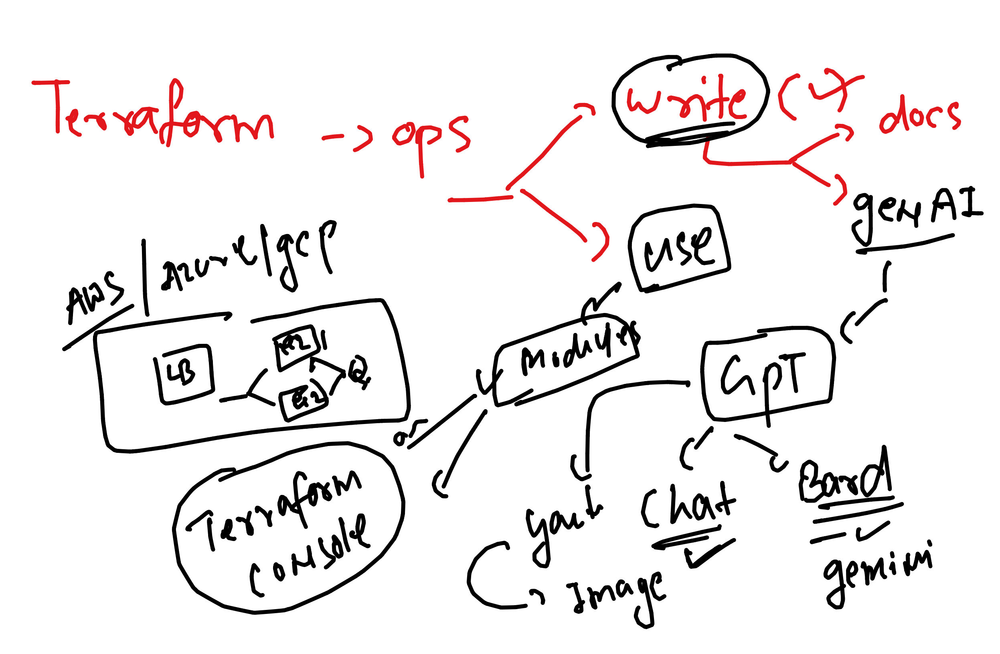
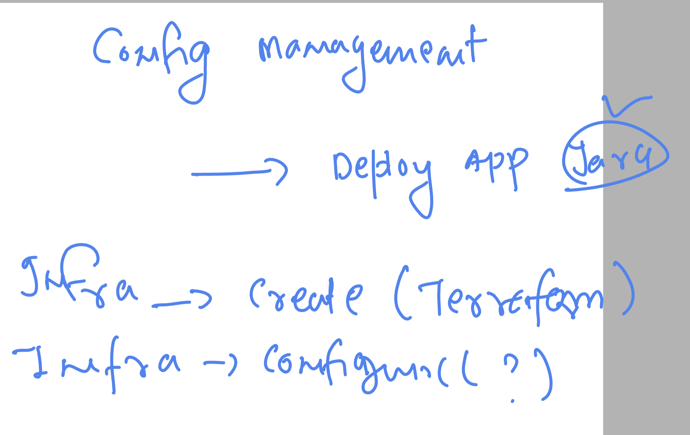
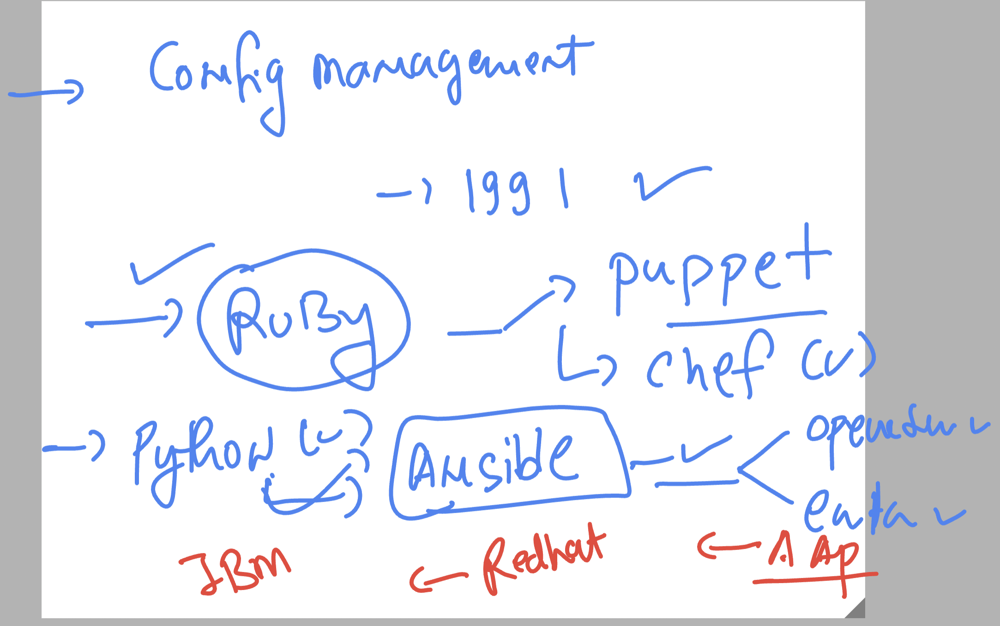
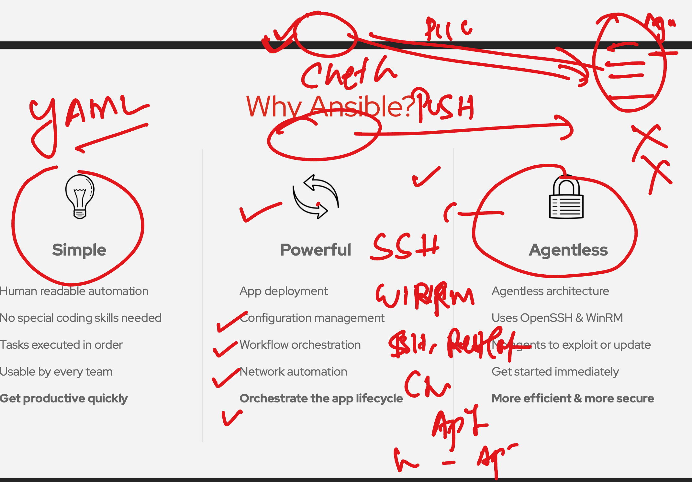
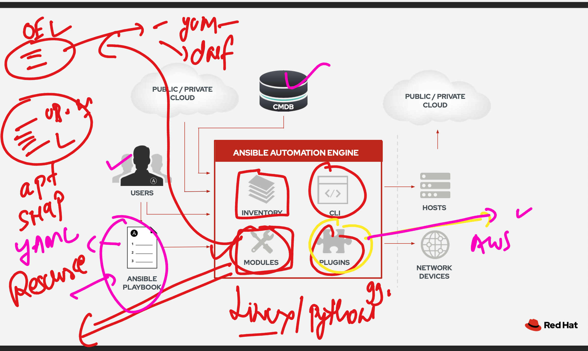

### Revision 



### terraform can't do configuration management 



### Introduction to Ansible platform -- ENTerprise -- AAP (ansible automation platform )



### ansible more details 



### ansible architecture 



### installing in amazon linux / rhel / fedora / centos / rockylinux / OEL 

```
amazon-linux-extras  install ansible2 
```

### verify 

```
ashu@ip-172-31-18-146 ~]$ ansible --version 
ansible 2.9.23
  config file = /etc/ansible/ansible.cfg
  configured module search path = [u'/home/ashu/.ansible/plugins/modules', u'/usr/share/ansible/plugins/modules']
  ansible python module location = /usr/lib/python2.7/site-packages/ansible
  executable location = /usr/bin/ansible
  python version = 2.7.18 (default, Dec 18 2023, 22:08:43) [GCC 7.3.1 20180712 (Red Hat 7.3.1-17)]
[ashu@ip-172-31-18-146 ~]$ 

```

### ansible config directory 


### creating ansible inventory and config file 

### inventory 

```
# this is ansible inventroy file 
[ashu-nodes]
192.168.1.10


```

### ansible.cfg 

```
[defaults]
inventory      = ./hosts # location of inventory file 
remote_port    = 22 # target host ssh port 
sudo_user      = root # optional 
remote_user    =  test # use by ansible to connect target hosts 
```

### to make password less connection b/w ansible and target host use key based 

```
ashu@ip-172-31-18-146 ashu-ansible]$ ssh-keygen 
Generating public/private rsa key pair.
Enter file in which to save the key (/home/ashu/.ssh/id_rsa): 
/home/ashu/.ssh/id_rsa already exists.
Overwrite (y/n)? y
Enter passphrase (empty for no passphrase): 
Enter same passphrase again: 
Your identification has been saved in /home/ashu/.ssh/id_rsa.
Your public key has been saved in /home/ashu/.ssh/id_rsa.pub.
The key fingerprint is:
SHA256:g84m4lUNjXJSJ+pSfuitgOnRb33AEjhSV6ASYs3W2A0 ashu@ip-172-31-18-146.ec2.internal
The key's randomart image is:
+---[RSA 2048]----+
|.oo +EB..        |
|o .*.* *         |
| .o.B + .        |
| ..* * +         |
|  o = * S        |
| o.o B o .       |
|o.o.+ B .        |
```

### transfer 

```
ssh-copy-id   test@192.168.1.10
```

### history 

```
  ansible  -i  hosts ashu-nodes  -u test -k  -m ping 
  440  ssh-keygen 
  441  ssh-copy-id   test@192.168.1.10
  442  ssh  test@192.168.1.10 
  443  ansible  -i  hosts ashu-nodes  -u test  -m ping 
```

### running ansible adhoc commands 

```
[ashu@ip-172-31-18-146 ashu-ansible]$ ansible -i devhost  all  -u test -m ping 
192.168.1.10 | SUCCESS => {
    "ansible_facts": {
        "discovered_interpreter_python": "/usr/bin/python3"
    }, 
    "changed": false, 
    "ping": "pong"
}
[ashu@ip-172-31-18-146 ashu-ansible]$ ansible -i devhost  all  -u test -m command -a  "date"
192.168.1.10 | CHANGED | rc=0 >>
Wed Mar 13 09:00:15 UTC 2024
[ashu@ip-172-31-18-146 ashu-ansible]$ date
Wed Mar 13 09:00:41 UTC 2024
[ashu@ip-172-31-18-146 ashu-ansible]$ ansible -i devhost  all  -u test -m command -a  "whoami"
192.168.1.10 | CHANGED | rc=0 >>
test
[ashu@ip-172-31-18-146 ashu-ansible]$ 

```

### listing modules in ansible machine 

```
[ashu@ip-172-31-18-146 ashu-ansible]$ ansible-doc  -l   |  wc  -l 
3387
[ashu@ip-172-31-18-146 ashu-ansible]$ ansible-doc  -l   |  grep  -i yum 
yum                                                           Manages packages with the `yum' package manager                                       
yum_repository                                                Add or remove YUM repositories                                                        
[ashu@ip-172-31-18-146 ashu-ansible]$ ansible-doc  -l   |  grep  -i apt
apt_repository                                                Add and remove APT repositories                                                       
apt_key                                                       Add or remove an apt key                                                              
skydive_capture                                               Module which manages flow capture on interfaces                                       
apt_rpm                                                       apt_rpm package manager                                                               
nios_naptr_record                                             Configure Infoblox NIOS NAPTR records                                                 
na_ontap_qos_adaptive_policy_group                            NetApp ONTAP Adaptive Quality of Service policy group                                 
vmware_vmkernel                                               Manages a VMware VMkernel Adapter of an ESXi host                                     
apt                                                           Manages apt-packages                                                                  
na_ontap_ucadapter                                            NetApp ONTAP UC adapter configuration                                                 
apt_repo                                                      Manage APT repositories via apt-repo                                                  
fortios_switch_controller_security_policy_captive_portal      Names of VLANs that use captive portal authentication in Fortinet's FortiOS and FortiG...
vmware_guest_network                                          Manage network adapters of specified virtual machine in given vCenter infrastructure  
[ashu@ip-172-31-18-146 ashu-ansible]$ 


```

### creating directory to make playbooks 

```
[ashu@ip-172-31-18-146 ashu-ansible]$ ls 
ansible.cfg  devhost  docker-compose.yaml  hosts  playbooks
[ashu@ip-172-31-18-146 ashu-ansible]$ tree 
.
├── ansible.cfg
├── devhost
├── docker-compose.yaml
├── hosts
└── playbooks
    └── install_soft.yaml

1 directory, 5 files
```

### RUnning playbook with sudo password access

```
[ashu@ip-172-31-18-146 ashu-ansible]$ ansible-playbook  -i  hosts -K playbooks/install_soft.yaml 
BECOME password: 

PLAY [ashunodes] ****************************************************************************************************************

TASK [Gathering Facts] **********************************************************************************************************
ok: [192.168.1.10]

TASK [installing git software] **************************************************************************************************
changed: [192.168.1.10]

PLAY RECAP **********************************************************************************************************************
192.168.1.10               : ok=2    changed=1    unreachable=0    failed=0    skipped=0    rescued=0    ignored=0   

[ashu@ip-172-31-18-146 ashu-ansible]$ ansible-playbook  -i  hosts -K playbooks/install_soft.yaml 
BECOME password: 

PLAY [ashunodes] ****************************************************************************************************************

TASK [Gathering Facts] **********************************************************************************************************
ok: [192.168.1.10]

TASK [installing git software] **************************************************************************************************
ok: [192.168.1.10]

PLAY RECAP **********************************************************************************************************************
192.168.1.10               : ok=2    changed=0    unreachable=0    failed=0    skipped=0    rescued=0    ignored=0   

```

### httpd and git 

```
---
- hosts: ashunodes # selecting group from inventory file 
  remote_user: test
  become: true # act like sudo for above user 
  tasks: # here we will define modules to use 
  - name: installing git software 
    yum: 
     name: git 
     state: present # present | installed | lastest -- we can use 

  - name: installing httpd software 
    yum: 
     name: httpd   
     state: absent # present | installed | lastest -- we can use 
```

### we can 

```
 ansible-playbook -i hosts -K  playbooks/install_soft.yaml -C
```

### playbook with internal variable 

```
---
- hosts: ashunodes # selecting group from inventory file 
  remote_user: test
  become: true # act like sudo for above user 
  vars: # defining internal variable 
    pkg: httpd 
    my_user: ashu 
  tasks: # here we will define modules to use 
  - name: installing git software 
    yum: 
     name: git 
     state: present # present | installed | lastest -- we can use 

  - name: installing "{{ pkg }}" software 
    yum: 
     name: "{{ pkg }}"
    # state: absent # present | installed | lastest -- we can use 
  - name: creating user with password 
    user:
     name: "{{ my_user }}"
     password: "{{ 'Hello@123' | password_hash('sha512') }}" # --- > /etc/shadow

  - name: copy webapp to target servers
    copy:
      src: ../webapp/ashu.html
      dest: /var/www/html/index.html 

  - name: starting "{{ pkg }}" service 
    service:
      name: "{{ pkg }}"
      state: started
      enabled: yes
```

### calling external variable file 

```
[ashu@ip-172-31-18-146 ashu-ansible]$ tree 
.
├── ansible.cfg
├── devhost
├── docker-compose.yaml
├── hosts
├── playbooks
│   └── install_soft.yaml
├── variables
│   └── myvar1.yml
└── webapp
    └── ashu.html

3 directories, 7 files
[ashu@ip-172-31-18-146 ashu-ansible]$ ls  variables/
myvar1.yml
[ashu@ip-172-31-18-146 ashu-ansible]$ cat  variables/myvar1.yml 
---
pkg: httpd
my_user: ashu

[ashu@ip-172-31-18-146 ashu-ansible]$ cat  playbooks/install_soft.yaml   | head 
---
- hosts: ashunodes # selecting group from inventory file 
  remote_user: test
  become: true # act like sudo for above user 
  vars_files: # calling external varilable file 
    - ../variables/myvar1.yml
```

### updated method 

```
---
- hosts: ashunodes # selecting group from inventory file 
  remote_user: test
  become: true # act like sudo for above user 
  vars_files: # calling external varilable file 
    - ../variables/myvar1.yml
  tasks: # here we will define modules to use 
  - yum: 
     name: git 
     state: present # present | installed | lastest -- we can use 
  - yum: 
     name: "{{ pkg  }}" 
     state: present 
  - user:
     name: "{{ my_user }}"
     password: "{{ 'Hello@123' | password_hash('sha512') }}" # --- > /etc/shadow
  - debug: 
      msg: "hey user {{ my_user }} got created !!"
  - copy:
      src: ../webapp/ashu.html
      dest: /var/www/html/index.html 
  - service:
      name: "{{ pkg }}"
      state: started
      enabled: yes
```


