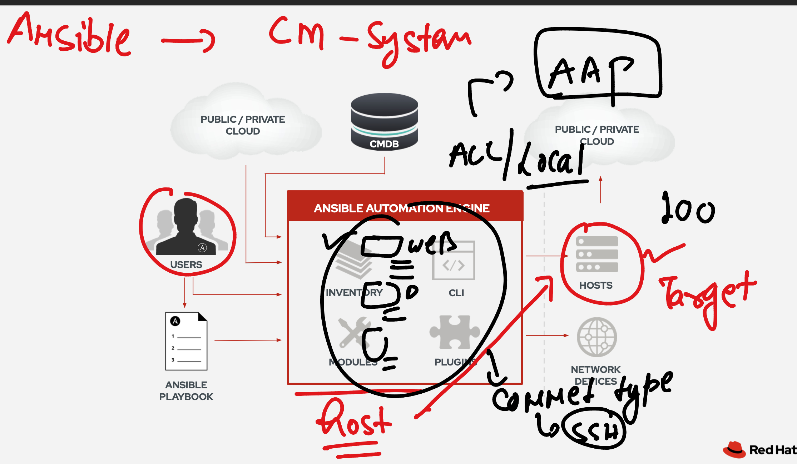
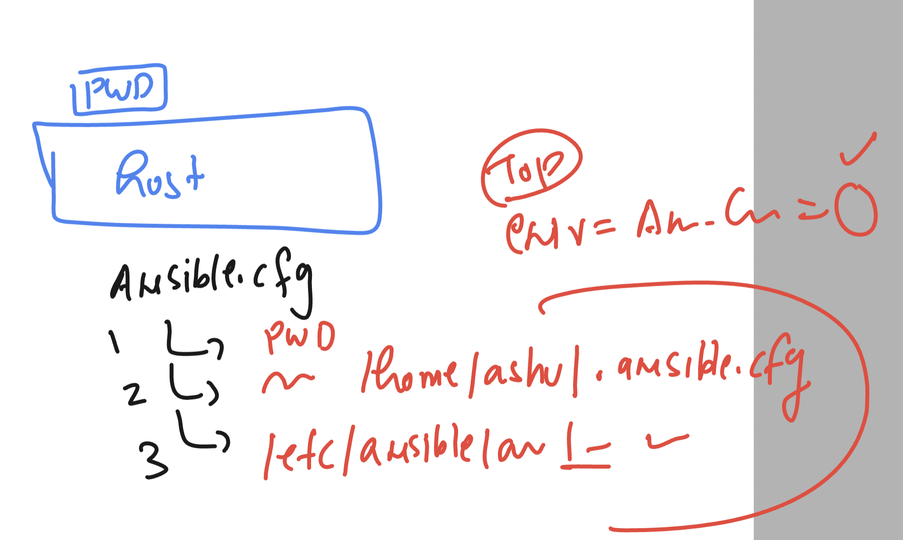
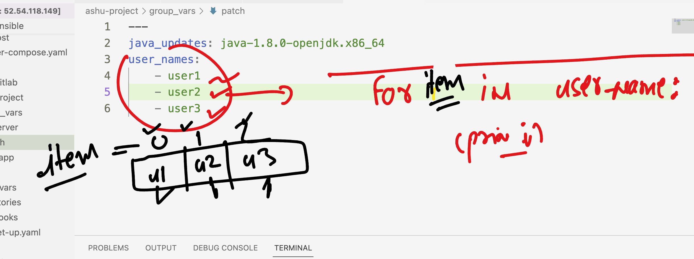

## Revision 



### ansible config file loading order 



### tree of ansible 

```
[ashu@ip-172-31-18-146 ashu-ansible]$ tree
.
├── ansible.cfg
├── devhost
├── docker-compose.yaml
├── group_vars
│   ├── common
│   ├── db
│   └── web
├── hosts
├── host_vars
│   ├── 192.168.1.10
│   └── 192.168.1.11
├── playbooks
│   ├── ashu-grpvar.yaml
│   ├── db.yml
│   ├── install_soft.yaml
│   ├── test.yaml
│   └── update-method.yml
├── variables
│   ├── myvar1.yml
│   └── test_var.yml
└── webapp
    ├── ashu.html
    └── db.sql
```

### project ansible directory structure 

```
ashu@ip-172-31-18-146 poc]$ pwd
/home/ashu/poc
[ashu@ip-172-31-18-146 poc]$ mkdir  ashu-project 
[ashu@ip-172-31-18-146 poc]$ cd  ashu-project/
[ashu@ip-172-31-18-146 ashu-project]$ mkdir  playbooks host_vars group_vars variables inventories roles 
[ashu@ip-172-31-18-146 ashu-project]$ tree 
.
├── group_vars
├── host_vars
├── inventories
├── playbooks
├── roles
└── variables

6 directories, 0 files
[ashu@ip-172-31-18-146 ashu-project]$ touch  ansible.cfg 
[ashu@ip-172-31-18-146 ashu-project]$ tree 
.
├── ansible.cfg
├── group_vars
├── host_vars
├── inventories
├── playbooks
├── roles
└── variables

6 directories, 1 file
[ashu@ip-172-31-18-146 ashu-project]$ 
```

### loop in ansible 



### facts in ansible 

```
[ashu@ip-172-31-18-146 ashu-project]$ 
[ashu@ip-172-31-18-146 ashu-project]$ ansible   localhost  -m setup   | grep -i hostname
            "HOSTNAME": "ip-172-31-18-146.ec2.internal", 
        "ansible_hostname": "ip-172-31-18-146", 
[ashu@ip-172-31-18-146 ashu-project]$ 
[ashu@ip-172-31-18-146 ashu-project]$ ansible  192.168.1.12  -m setup   | grep -i hostname
        "ansible_hostname": "ashunode3", 
                "mount": "/etc/hostname", 
[ashu@ip-172-31-18-146 ashu-project]$ ansible  patch  -m setup   | grep -i hostname
        "ansible_hostname": "ashunode3", 
                "mount": "/etc/hostname", 
        "ansible_hostname": "ashunode1", 
                "mount": "/etc/hostname", 
        "ansible_hostname": "ashunode2", 
                "mount": "/etc/hostname", 
[ashu@ip-172-31-18-146 ashu-project]$ 


```

### db-server playbook

```
---
- hosts: patch
  become: true 
  tasks:
  - name: Installing java in all the system 
    yum:
      name: "{{ javaupdates }}"
      state: present 

  - name: create multiple users in patch group hosts 
    user: 
      name: "{{ item }}"
      state: present
    loop: "{{ usernames }}" # for -- > with_items -- loop

  - name: installing db software
    yum:
      name: "{{ dbsoft }}" 
      state: present
    when: ansible_hostname  == 'ashunode3'

  - name: starting mariadb service 
    service:
      name: mariadb
      state: started
      enabled: yes
    when: ansible_hostname  == 'ashunode3'  
```

### checking syntax always 

```
ansible-playbook  playbooks/dbset-up.yaml --syntax-check 

playbook: playbooks/dbset-up.yaml
[ashu@ip-172-31-18-146 ashu-project]$ 


```

### tags in ansible 


### implement

```
---
- hosts: patch
  become: true 
  tasks:
  - name: Installing java in all the system 
    yum:
      name: "{{ javaupdates }}"
      state: present 
    tags:
    - install_java

  - name: create multiple users in patch group hosts 
    user: 
      name: "{{ item }}"
      state: present
    loop: "{{ usernames }}" # for -- > with_items -- loop

  - name: installing db software
    yum:
      name: "{{ dbsoft }}" 
      state: present
    when: ansible_hostname  == 'ashunode3'

  - name: starting mariadb service 
    service:
      name: mariadb
      state: started
      enabled: yes
    when: ansible_hostname  == 'ashunode3'  

   
```

### running

```
shu@ip-172-31-18-146 ashu-project]$ ansible-playbook  playbooks/dbset-up.yaml -K --tags  install_java
BECOME password: 

PLAY [patch] ********************************************************************************************************************************************

TASK [Gathering Facts] **********************************************************************************************************************************
ok: [192.168.1.11]
ok: [192.168.1.10]
ok: [192.168.1.12]
```
### creating vault password

```
[ashu@ip-172-31-18-146 ashu-project]$ ls
ansible.cfg  group_vars  hosts  host_vars  playbooks  roles  variables
[ashu@ip-172-31-18-146 ashu-project]$ 
[ashu@ip-172-31-18-146 ashu-project]$ ansible-vault  create variables/db-pass.yaml 
New Vault password: 
Confirm New Vault password: 
[ashu@ip-172-31-18-146 ashu-project]$ cat variables/db-pass.yaml 
$ANSIBLE_VAULT;1.1;AES256
64373234656362383265646132636666653563326430393230316430346336333062356334323761
3038613937663266626239353337353530653430393930330a396530613137636239386437313939
35336365643536613831636638663834626664316532373731643433373662636637656431633665
6663313665626630380a306265396463366635386561323931363466646335623636373831666635
35623462376335323533353831646239643330316331666138633961343666653331
[ashu@ip-172-31-18-146 ashu-project]$ ansible-vault view  variables/db-pass.yaml 
Vault password: 
---
db_password: Redhat@123
[ashu@ip-172-31-18-146 ashu-project]$ 
```

### playbook

```
---
- hosts: patch
  become: true 
  vars_files:
  - ../variables/db-pass.yaml
  tasks:
  - name: Installing java in all the system 
    yum:
      name: "{{ javaupdates }}"
      state: present 
    tags:
    - install_java

  - name: create multiple users in patch group hosts 
    user: 
      name: "{{ item }}"
      state: present
    loop: "{{ usernames }}" # for -- > with_items -- loop

  - name: implementing block for db setup 
    block:
    - name: installing db software
      yum:
        name: "{{ item }}" 
        state: present
      loop: "{{ dbsoft }}"

    - name: starting mariadb service 
      service:
        name: mariadb
        state: started
        enabled: yes
    - name: setting root/admin password of database server
      mysql_user:
        name: root
        password: "{{ db_password }}"
        login_user: root
        login_password: "{{ db_password }}"  # Empty password for the default login (no password)
        host: localhost
        update_password: always

    when: ansible_hostname  == 'ashunode3'  

   
```

### running playbook

```
ansible-playbook  playbooks/dbset-up.yaml -K --ask-vault-pass
```
