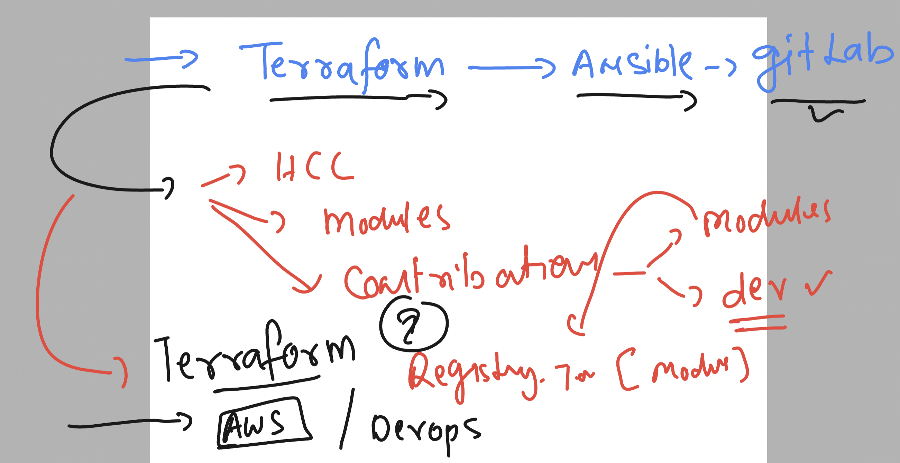
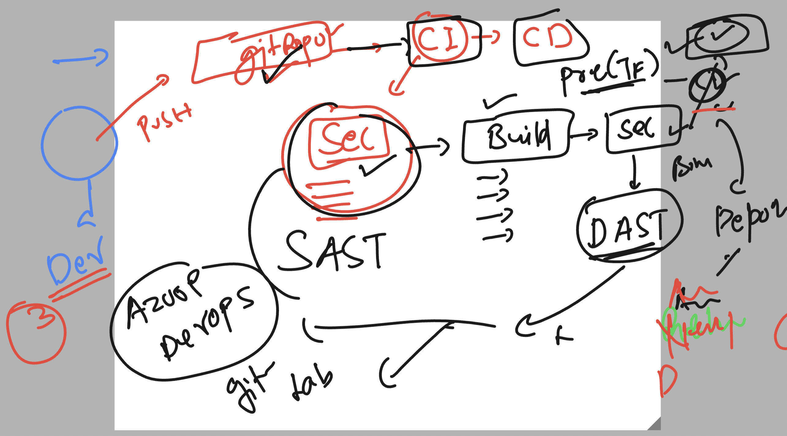
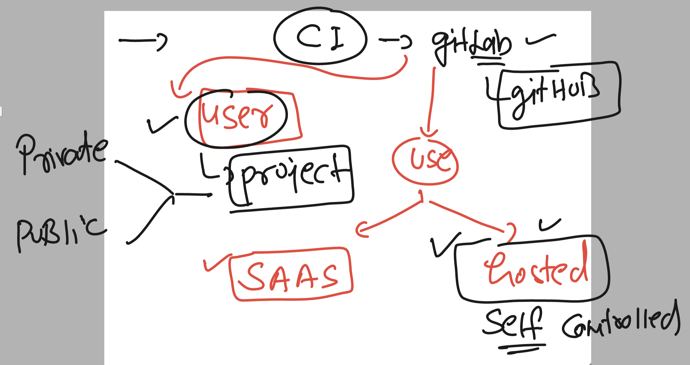
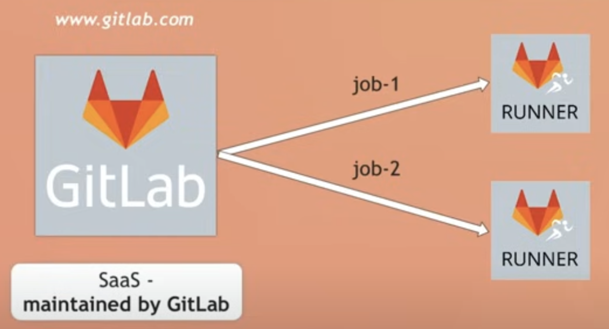
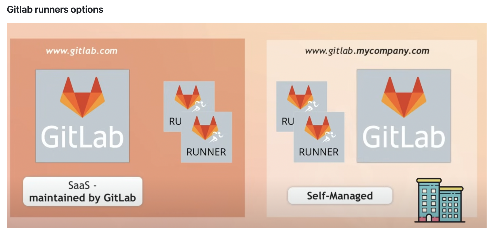
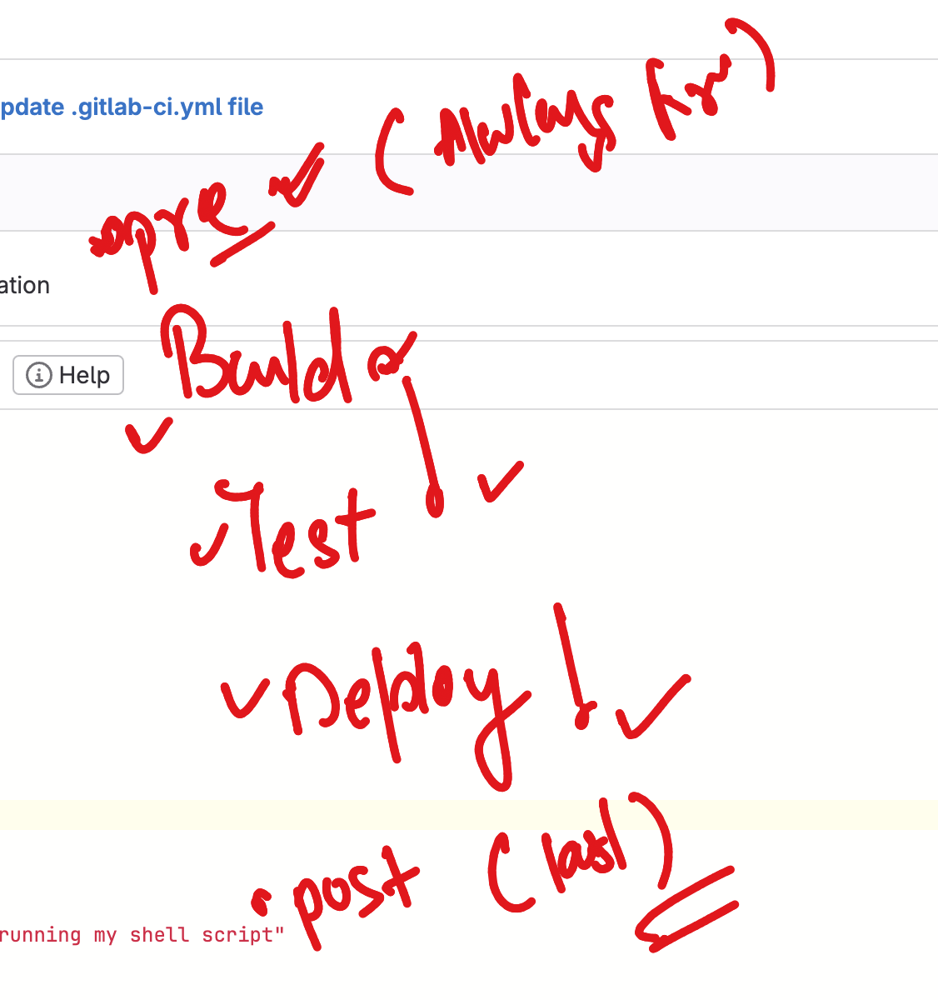

## Revision 

### Terraform more commands

### please read about  ---graph 

### state list and manage

```
ashu@ip-172-31-18-146 wc]$ terraform  state list 
data.aws_vpc.ashu-vpcnew
data.template_file.ashu-user_data
aws_instance.rp-vm1[0]
aws_instance.rp-vm1[1]
aws_key_pair.generated_key
aws_lb.ashu-app-lb1
aws_lb_listener.ashu-front_end
aws_lb_target_group.ashu-tg-group
aws_lb_target_group_attachment.ashu-attach[0]
aws_lb_target_group_attachment.ashu-attach[1]
aws_security_group.ashu-allow_tls
aws_vpc_security_group_egress_rule.ashu-allow_all_traffic_ipv4
aws_vpc_security_group_ingress_rule.ashu-allow_22
aws_vpc_security_group_ingress_rule.ashu-allow_80
local_file.ssh_key
tls_private_key.private_key
[ashu@ip-172-31-18-146 wc]$ terraform  destroy -target=aws_instance.rp-vm1[0]
data.template_file.ashu-user_data: Reading...
data.template_file.ashu-user_data: Read complete after 0s [id=c616cc186df812ce6adc607d3535c2f9b62de61fdff67d56690e7eed28d7cef8]
tls_private_key.private_key: Refreshing state... [id=1138d622856813be677de7b5c8ea4775827e66fb]
data.aws_vpc.ashu-vpcnew: Reading...
aws_key_pair.generated_key: Refreshing state... [id=ashu-keynew123]
data.aws_vpc.ashu-vpcnew: Read complete after 1s [id=vpc-0613e72a46c8cb335]
aws_security_group.ashu-allow_tls: Refreshing state... [id=sg-03d3494fcfe6128e3]
aws_instance.rp-vm1[0]: Refreshing state... [id=i-0b791a582c2a5c67c]

Terraform used the selected providers to generate the following execution plan. Resource actions are indicated with the
following symbols:
  - destroy

Terraform will perform the following actions:

  # aws_instance.rp-vm1[0] will be destroyed
  - resource "aws_instance" "rp-vm1" {
      - ami                                  = "ami-07761f3ae34c4478d" -> null
      - arn                                  = "arn:aws:ec2:us-east-1:751136288263:instance/i-0b791a582c2a5c67c" -> null
      - associate_public_ip_address          = true -> null
      - availability_zone                    = "us-east-1b" -> null
      - cpu_core_count                       = 1 -> null
      - cpu_threads_per_core                 = 1 -> null
      - disable_api_stop                     = false -> null
      - disable_api_termination              = false -> null
      - ebs_optimized                        = false -> null
      - get_password_data                    = false -> null
```


### terraform all 




### ansible roles path setup

## ansible.cfg

```
[defaults]
remote_user = test 
# default inventory location 
inventory = ./hosts 
roles_path = /home/ashu/poc/ashu-project/roles
```

### creating role using ansible-galaxy

```
ashu@ip-172-31-18-146 ashu-project]$ ls
ansible.cfg  group_vars  hosts  host_vars  playbooks  roles  variables
[ashu@ip-172-31-18-146 ashu-project]$ pwd
/home/ashu/poc/ashu-project
[ashu@ip-172-31-18-146 ashu-project]$ cd  roles/
[ashu@ip-172-31-18-146 roles]$ ansible-galaxy init  ashu-webapp
- Role ashu-webapp was created successfully
[ashu@ip-172-31-18-146 roles]$ ls
ashu-webapp  db  webhost
[ashu@ip-172-31-18-146 roles]$ 

```

### CI CD 



### GItlab projects



### upload public key to gitlab server  

### we are cloning gitlab projecti in local machine 

```
git clone  git@gitlab.com:ashutoshh/ashu-roche.git
Cloning into 'ashu-roche'...
remote: Enumerating objects: 3, done.
remote: Counting objects: 100% (3/3), done.
remote: Compressing objects: 100% (2/2), done.
remote: Total 3 (delta 0), reused 0 (delta 0), pack-reused 0
Receiving objects: 100% (3/3), done.
[ashu@ip-172-31-18-146 poc]$ ls
ashu-ansible  ashu-project  ashu-terraform  mys3                               tf-imports
ashu-gitlab   ashu-roche    modules         roche-tf-ansible-gitlab_11thmarch  wc
[ashu@ip-172-31-18-146 poc]$ 


```

### jobs in gitlab 



### servers in gitlab 



### workload and gitlb 


### sample gitlab-ci yaml file with stage

```
# for defining stages 
stages:
  - ashu-stage1
  - ashu-code2 

# for defining jobs 
ashu-job1:
  stage: ashu-stage1  # calling stage 
  script:
    - echo "hello world"
    - whoami
    - cat /etc/os-release 
    - uname -r 

ashu-job2: 
  stage: ashu-code2 # calling stage
  script:
    - echo "hello world now i will be running my shell script"
    - bash run.sh 
```

### stages 



### Installing custum gitlab runners

```
[root@ip-172-31-58-47 ~]# history 
    1  yum install git -y
    2  history 
    3  amazon-linux-extras  install ansible2
    4  sudo yum-config-manager --add-repo https://rpm.releases.hashicorp.com/AmazonLinux/hashicorp.repo
    5  sudo yum -y install terraform
    6  history 

```

### Installing gitlab runner 

```
rpm -ivh https://s3.dualstack.us-east-1.amazonaws.com/gitlab-runner-downloads/latest/rpm/gitlab-runner_amd64-fips.rpm 
```

### Register a new runner with shell executor 

```
[ec2-user@ip-172-31-58-47 ~]$ sudo  gitlab-runner   register 
Runtime platform                                    arch=amd64 os=linux pid=3779 revision=782c6ecb version=16.9.1
Running in system-mode.                            
                                                   
Enter the GitLab instance URL (for example, https://gitlab.com/):
https://gitlab.com/
Enter the registration token:
GR13489414z_Ai4q7rdof98awsea3
Enter a description for the runner:
[ip-172-31-58-47.ec2.internal]: ashu-personal-runner
Enter tags for the runner (comma-separated):
ashu,aws,terraform,ansible
Enter optional maintenance note for the runner:

WARNING: Support for registration tokens and runner parameters in the 'register' command has been deprecated in GitLab Runner 15.6 and will be replaced with support for authentication tokens. For more information, see https://docs.gitlab.com/ee/ci/runners/new_creation_workflow 
Registering runner... succeeded                     runner=GR13489414z_Ai4q7
Enter an executor: shell, ssh, parallels, docker, docker-windows, docker+machine, docker-autoscaler, custom, virtualbox, kubernetes, instance:
shell
Runner registered successfully. Feel free to start it, but if it's running already the config should be automatically reloaded!
 
Configuration (with the authentication token) was saved in "/etc/gitlab-runner/config.toml" 
```

### checking service of gitlab runner

```
[ec2-user@ip-172-31-58-47 ~]$ sudo systemctl status gitlab-runner.service 
● gitlab-runner.service - GitLab Runner
   Loaded: loaded (/etc/systemd/system/gitlab-runner.service; enabled; vendor preset: disabled)
   Active: active (running) since Fri 2024-03-15 10:36:25 UTC; 21min ago
 Main PID: 3756 (gitlab-runner)
   CGroup: /system.slice/gitlab-runner.service
           └─3756 /usr/bin/gitlab-runner run --working-directory /home/gitlab-runner --config /etc/gitlab-runner/config.to...

Mar 15 10:36:25 ip-172-31-58-47.ec2.internal gitlab-runner[3756]: Runtime platform                                    a...9.1
Mar 15 10:36:25 ip-172-31-58-47.ec2.internal gitlab-runner[3756]: Starting multi-runner from /etc/gitlab-runner/config....s=0
Mar 15 10:36:25 ip-172-31-58-47.ec2.internal gitlab-runner[3756]: Running in system-mode.                           
Mar 15 10:36:25 ip-172-31-58-47.ec2.internal gitlab-runner[3756]: 
Mar 15 10:36:25 ip-172-31-58-47.ec2.internal gitlab-runner[3756]: Created missing unique system ID                    s...4ec
Mar 15 10:36:25 ip-172-31-58-47.ec2.internal gitlab-runner[3756]: Configuration loaded                                b...s=1
Mar 15 10:36:25 ip-172-31-58-47.ec2.internal gitlab-runner[3756]: listen_address not defined, metrics & debug endpoints...s=1
Mar 15 10:36:25 ip-172-31-58-47.ec2.internal gitlab-runner[3756]: [session_server].listen_address not defined, session ...s=1
Mar 15 10:36:25 ip-172-31-58-47.ec2.internal gitlab-runner[3756]: Initializing executor providers                     b...s=1
Mar 15 10:50:25 ip-172-31-58-47.ec2.internal gitlab-runner[3756]: Configuration loaded                                b...s=1
Hint: Some lines were ellipsized, use -l to show in full.
[ec2-user@ip-172-31-58-47 ~]$ sudo systemctl enable  gitlab-runner.service 
[ec2-user@ip-172-31-58-47 ~]$ 

```

### more about gitlab runner options

```
[ec2-user@ip-172-31-58-47 ~]$ sudo gitlab-runner  verify 
Runtime platform                                    arch=amd64 os=linux pid=3938 revision=782c6ecb version=16.9.1
Running in system-mode.                            
                                                   
Verifying runner... is alive                        runner=fNd61fTC
[ec2-user@ip-172-31-58-47 ~]$ sudo gitlab-runner  list
Runtime platform                                    arch=amd64 os=linux pid=3945 revision=782c6ecb version=16.9.1
Listing configured runners                          ConfigFile=/etc/gitlab-runner/config.toml
ashu-personal-runner                                Executor=shell Token=fNd61fTCn3UZPVn5uvLG URL=https://gitlab.com/
[ec2-user@ip-172-31-58-47 ~]$ 
[ec2-user@ip-172-31-58-47 ~]$ 

```

### pipeline yaml file 

```
Primary navigation
Homepage

 Search or go to…
Project
A
ashu-roche

Pinned
Issues
0
Merge requests
0

Manage

Plan

Code
Merge requests
0
Repository
Branches
Commits
Tags
Repository graph
Compare revisions
Snippets

Build

Secure

Deploy

Operate

Monitor

Analyze

Settings
Delvex
ashu-roche
Repository
You pushed to 
dev
 1 minute ago
ashu-roche
.gitlab-ci.yml
Delvex's avatar
Update .gitlab-ci.yml file
Delvex authored 1 minute ago
226268bf
.gitlab-ci.yml
417 B
# Define tags
default:
  tags:
    - ashu
    - aws
# Define stages
stages:
  - ashu-stage1
  - ashu-code2
# Define jobs
ashu-job1:
  stage: ashu-stage1
  script:
    - echo "hello world"
    - whoami
    - cat /etc/os-release
    - uname -r
    - terraform --version
    - ansible --version
ashu-job2:
  stage: ashu-code2
  script:
    - echo "hello world now I will be running my shell script"
    - bash run.sh

```

